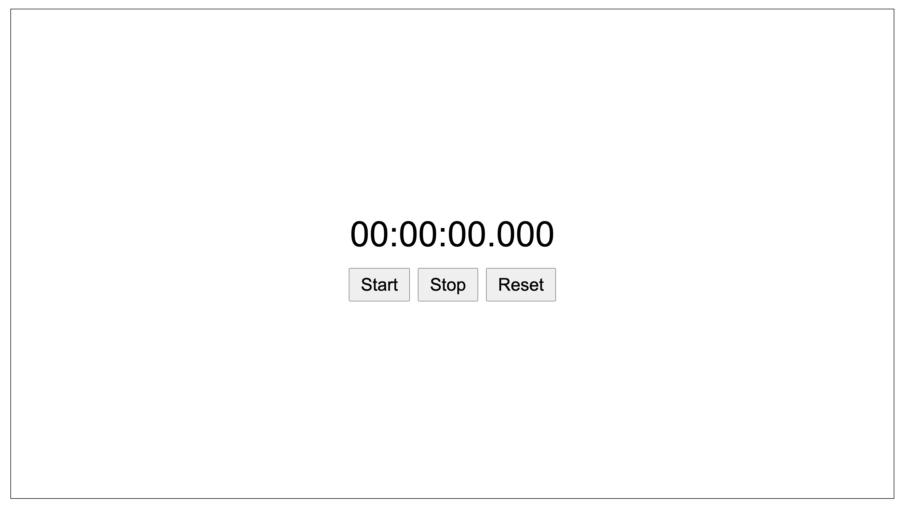
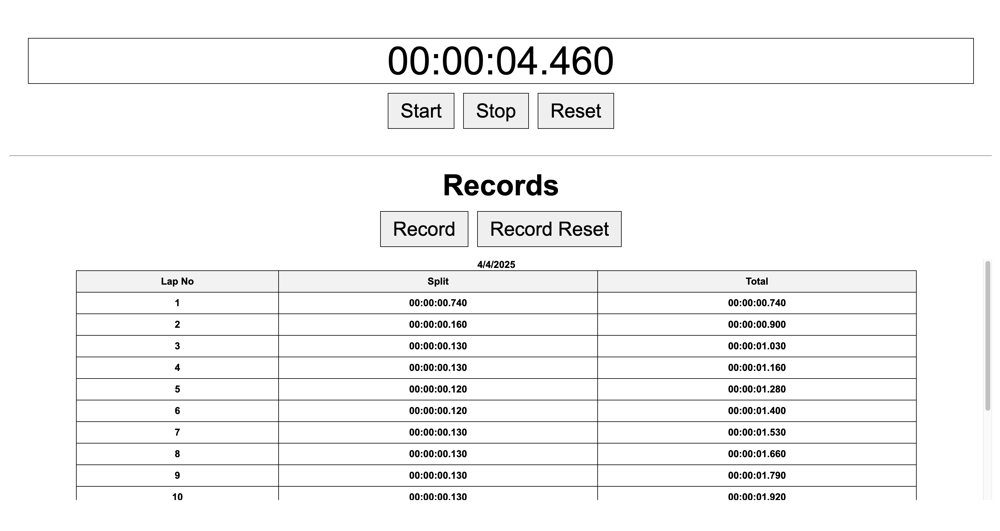

# Stopwatch

## Description
HTML, CSS, JavaScript를 활용하여 초시계 제작

## 기능
- 시작, 일시정지, 초기화
- 기록 표시: Lap, Split, Total
- 기록 저장

## How To Use
1) repository 다운받기
```
git clone https://github.com/cogito30/js_stopwatch.git
```
2) index.html를 브라우저로 열기

## Result


